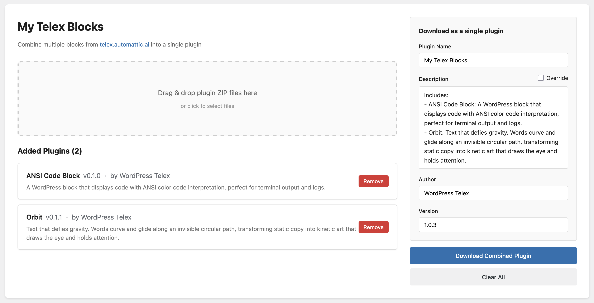

# My Telex Blocks

[telex.automattic.ai](https://telex.automattic.ai/) is a great tool for generating WordPress blocks. But if you create multiple blocks, you'll end up with multiple plugins. My Telex Blocks lets you combine multiple Telex-generated blocks into a single plugin.

The version auto-updates with every download so that you can keep track of your latest version. If you have a new version of a block, or want to add a new one, simply drag that new zip file and re-download your updated single plugin, and then upload that to your WordPress to upgrade the combined plugin there.

Try it now at [https://akirk.github.io/my-telex-blocks/](https://akirk.github.io/my-telex-blocks/)

## Workflow

1. Visit **https://akirk.github.io/my-telex-blocks/**
2. Drag and drop plugin ZIP files from Telex (or click to select files)
3. The blocks will be listed with their descriptions
4. Configure the plugin name, author, and version on the right sidebar
5. Click "Download Combined Plugin" to get your combined plugin ZIP
6. Install the combined plugin in WordPress like any other plugin
7. Come back anytime to add or update blocks and repeat

## Features

- **Client-side only**: All processing happens in your browser - no server uploads
- **Persistent storage**: Your blocks are saved using IndexedDB and survive page reloads
- **Auto-description**: Generates a description listing all included blocks
- **Version management**: Auto-increments version number with each download
- **Plugin replacement**: Upload a newer version of a block to replace the existing one

## Technical Details

This is a single-page HTML application that uses:
- [JSZip](https://stuk.github.io/jszip/) for ZIP file manipulation
- IndexedDB for persistent binary storage
- localStorage for form data persistence

The combined plugin creates a proper WordPress plugin structure with each block in its own subdirectory and a main loader file that includes them all.

## License

MIT
